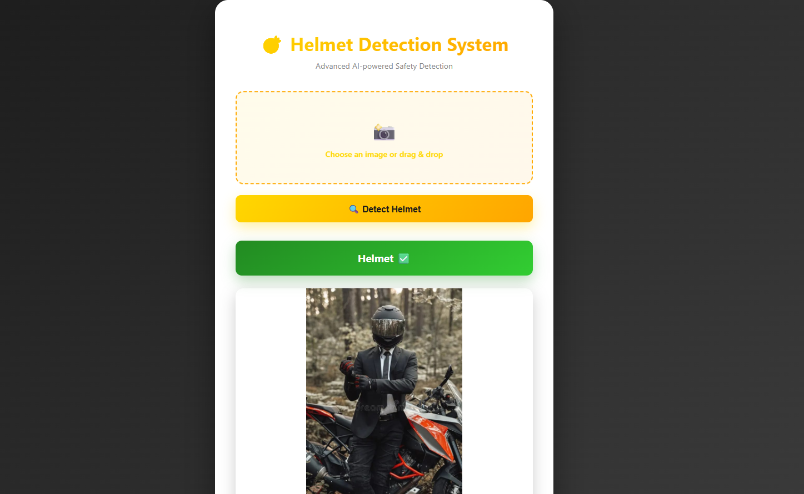
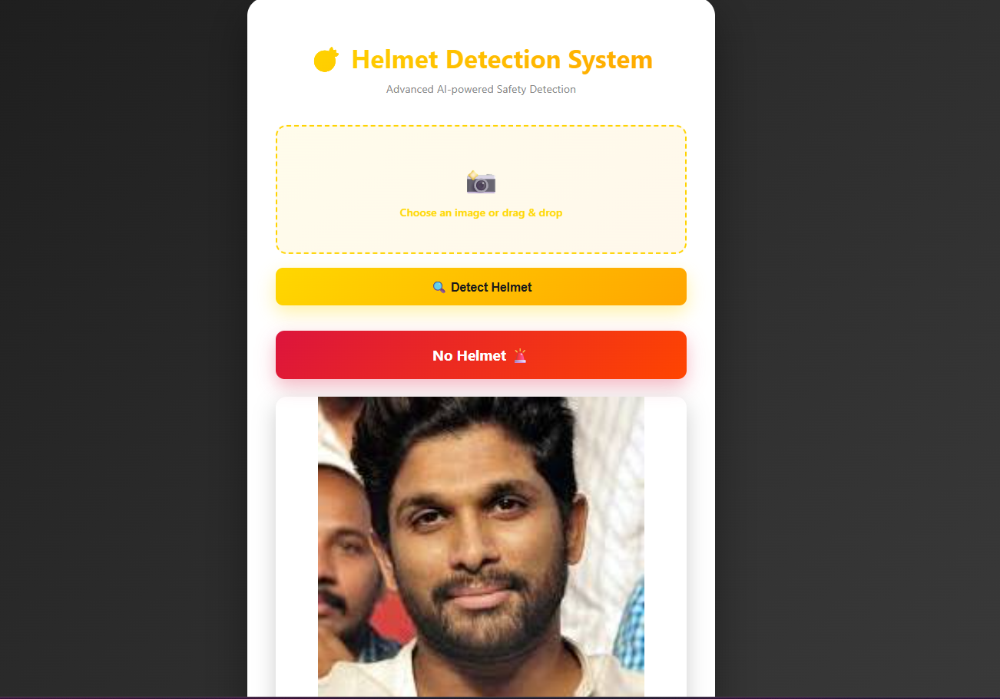
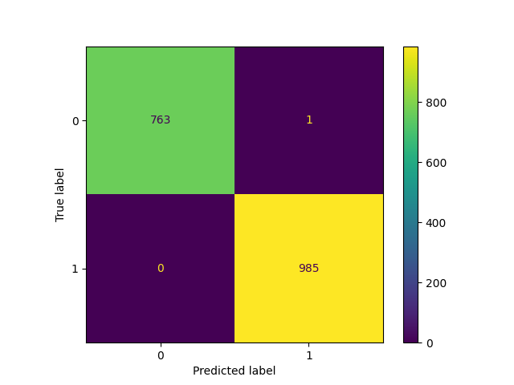
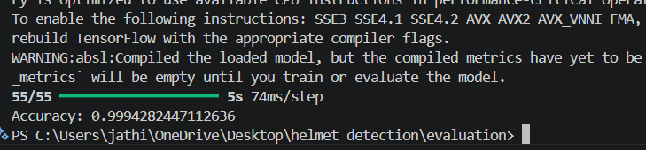
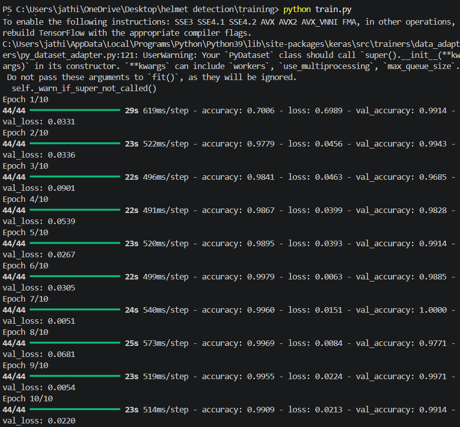

# 🚀 Helmet Detection Web Application

## 📌 Overview
This project is a full-stack Computer Vision application that detects whether a person is wearing a helmet or not using a Convolutional Neural Network (CNN). The system processes images and provides real-time predictions through a web interface.

---

## 🛠 Tech Stack
- Python
- TensorFlow / Keras
- OpenCV (for preprocessing)
- Flask (Backend)
- HTML, CSS (Frontend)
- Matplotlib (Visualization)

---

## 🧠 Model Details
- Built a CNN model for binary classification (Helmet / No Helmet)
- Used real-world datasets (helmet images + human face images)
- Applied data augmentation for better generalization
- Trained over multiple epochs to achieve high performance

---

## 📊 Results
- Accuracy: **~99%**
- Model Performance evaluated using:
  - Confusion Matrix
  - Validation Accuracy

---

## 📸 Outputs

### 🔹 Helmet vs No Helmet Detection

| Helmet Detection | No Helmet Detection |
|-----------------|-------------------|
|  |  |

---

### 📊 Model Evaluation

| Confusion Matrix | Accuracy |
|------------------|----------|
|  |  |

---

### 💻 Training Output

<p align="center">
  
</p>

---

## 🚀 Features
- Real-time image classification
- Web-based interface for easy interaction
- High accuracy prediction
- End-to-end ML pipeline (data → training → evaluation → deployment)

---

📁 Project Structure

helmet-detection-web/
│
├── dataset/        # Dataset files (images, annotations)
├── training/       # Model training scripts and configs
├── evaluation/     # Evaluation and testing scripts
├── app/            # Main application logic
├── static/         # Static assets (CSS, JS, images)
├── templates/      # HTML templates
├── models/         # Trained models / weights
└── README.md       # Project documentation

---

## ▶️ How to Run

```bash
pip install -r requirements.txt
cd app
python app.py

Then open:
👉 http://127.0.0.1:5000/
